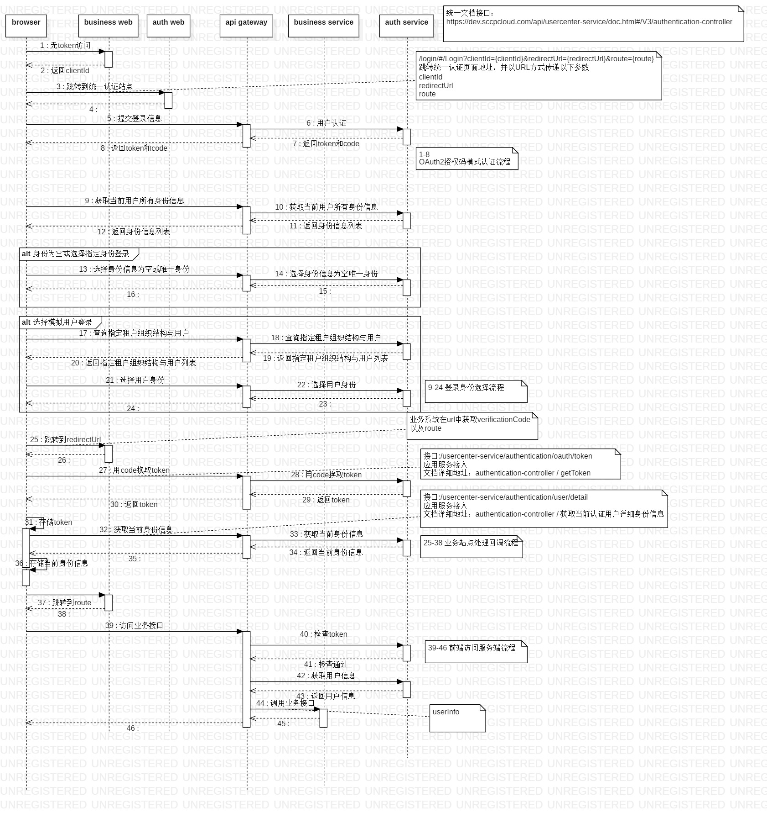
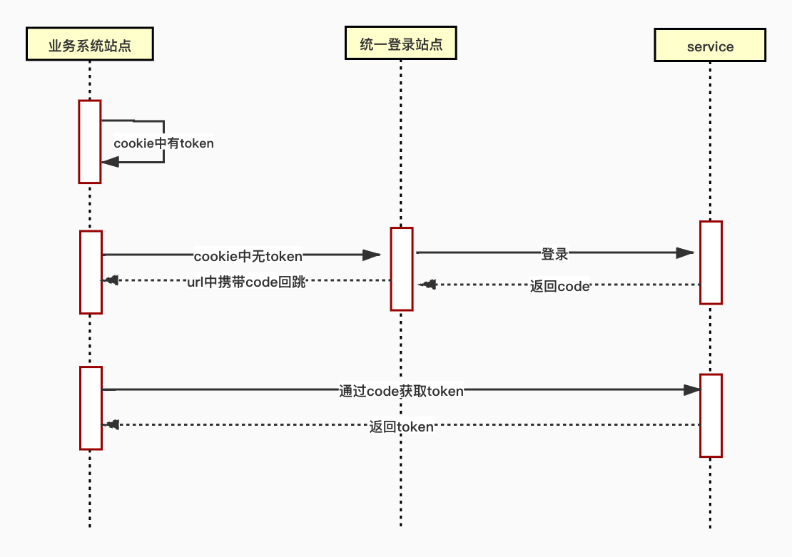

# 统一认证 front-end demo

- service 时序图


- front-end 时序图


## 统一认证授权流程
- 第一步：用户访问业务站点，在渲染站点之前通过`@jusda/auth-tools`权限认证工具函数做登录状态校验，未登录状态下会跳转到统一登录站点。
- 第二步：在统一登录站点用户登陆后，服务器将生成一个用户凭证（verificationCode），这个用户凭证会附加在重定向的地址redirectUri的后面并跳回业务站点。
- 第三步：业务站点根据url中的verificationCode获取token，并将token存储到业务站点的cookie中。


## 关键代码目录

```bash
├── public
│   ├── config.js  # 约定的全局配置
|   |——— routes.ts # 路由配置
|   |——— theme.ts  # 主题配置
├── src
│   ├── app.tsx #umijs运行时配置 登录鉴权
│   └── pages
│       ├── document.ejs #html引入config.js

# 其他目录结构见 https://umijs.org/zh-CN/docs/directory-structure
```

## npm package

- [@jusda/auth-tools](https://gitlab.jusdaglobal.com/jusda-ui/jusda-tools/tree/dev-0.0.17/packages/auth-tools)

## 启动项目

- 安装依赖 `npm i --registry http://nexus.jusdaglobal.com/repository/npm-group`
- 运行 `npm run start`

## config/config.ts 全局配置

- 在 /config/config.js 中默认配置如下：
```js
{
    hash: true,             // 配置让生成的文件包含 hash 后缀，通常用于增量发布和避免浏览器加载缓存。见 https://umijs.org/zh-CN/config#has
    publicPath: './',       // 配置 webpack 的 publicPath。     见 https://umijs.org/zh-CN/config#publicpath
    // favicon: '', // favicon 地址
    history: {
        type: 'hash',       // router hash。                  见 https://umijs.org/zh-CN/config#history
    },
    theme: {
         '@primary-color': '#ffc500',
    },                      // less 变量,配置主题时使用。实际 theme 配置，已切分到 ./theme.ts 文件内。    见 https://ant.design/docs/react/customize-theme-cn
    outputPath: '/build',   
    // ref: https://umijs.org/zh/config/#disableredirecthoist 解决路由重定向失效
    // disableRedirectHoist: true,
    routes: [],              // 配置式路由，实际路由配置，已切分到 ./routes.ts 文件内。                  见 https://umijs.org/zh-CN/docs/routing
}
```
 
